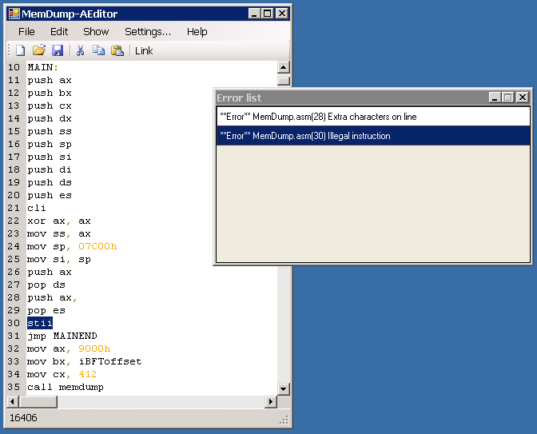

# aeditor
AEditor is Assembler editor that makes it easier to write, edit, compile and debug Turbo Assembler code. Based on ScintillaNET control. It's developed in C#

**Features**
 - Code highlighting (based on ScintillaNET control)
 - Compile and link assembler code in Turbo assembler in one click. Running compiled program in Turbo debugger is an option.
 - Quick navigation to errors detected by compiler
 - Easy to use
 - Russian or English interface depending on OS interface language settings

**Screenshot**

